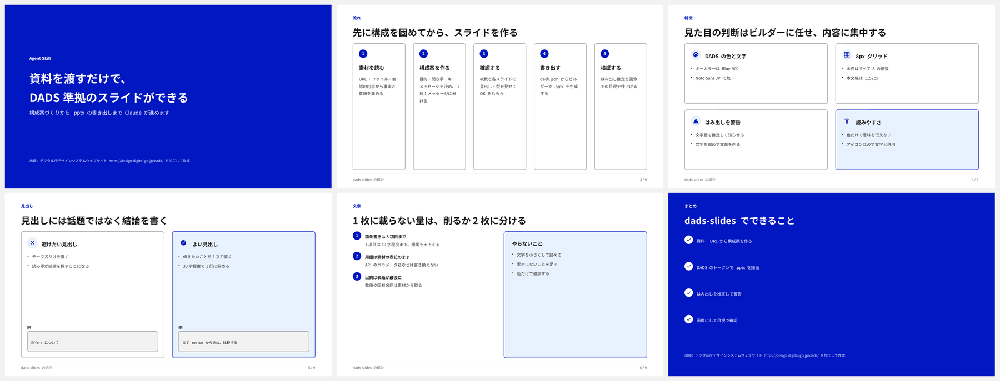

# dads-slides

資料や URL の内容を整理・構造化してから、[デジタル庁デザインシステム（DADS）](https://design.digital.go.jp/dads/)のルールに沿った PowerPoint（.pptx）スライドを Claude に作ってもらうための [Agent Skill](https://platform.claude.com/docs/en/agents-and-tools/agent-skills/overview) です。



> [!NOTE]
> 本スキルは個人が作成した非公式のツールです。デジタル庁とは関係なく、デジタル庁の公式ツールではありません。

## できること

「この資料を DADS でスライドにして」と頼むと、Claude が次の順に進めます。

1. 素材（URL・添付ファイル・会話の内容）を読む
2. 目的・聞き手・キーメッセージを決め、1枚1メッセージの構成案を作る（作る前に確認を求めます）
3. 構成案を `deck.json` にまとめる
4. 同梱のビルダーで .pptx を書き出す（色・文字・余白は DADS のトークンで描画）
5. 文字のはみ出しを推定し、画像にして目で確認する

見た目はビルダーが DADS のルールで決めるので、Claude は「何をどの型で見せるか」に集中します。

| 型 | 使いどころ |
|---|---|
| `title` / `section` / `summary` | 表紙・章の区切り・まとめ（濃い青の背景） |
| `stats` | 押さえるべき数値 2〜4 個 |
| `cards` | 並列の項目 2〜4 個 |
| `steps` | 順番のある手順 3〜5 個 |
| `twoColumn` | 2 つの話題の対比、例文・コードつき |
| `numbered` | 優先順位のある項目＋補足カード |
| `table` | 行と列で比べるデータ |

実装している主な DADS のルール：キーカラー Blue-900、書体 Noto Sans JP、8px グリッド、最小文字サイズ 14px、文字のコントラスト比 4.5:1 以上、カードは背景色と外周線を持つ、アイコンは必ず文字と組み合わせる、など。

## 必要なもの

- コードを実行できる Claude（claude.ai のコード実行・ファイル作成を有効にした状態、または Claude Code）
- 作業環境に Node.js（npm パッケージ `pptxgenjs` `react-icons` `react` `react-dom` `sharp` は Claude が入れます）
- 仕上がりを画像で確認するために LibreOffice（あれば）
- スライドを開く PC に Noto Sans JP / Noto Sans Mono（[Google Fonts](https://fonts.google.com/noto/specimen/Noto+Sans+JP) から無料で入手できます）

## インストール

### claude.ai

1. [Releases](../../releases) から `dads-slides.zip` をダウンロードします。
   - 緑の「Code」ボタンの「Download ZIP」は、フォルダ名が `…-main` になるためアップロードできません。
2. claude.ai で **Customize → Skills** を開き、「+」→「Create skill」→「Upload a skill」から ZIP をアップロードします。

### Claude Code

スキルのフォルダに clone します（このリポジトリの URL は「Code」ボタンからコピーできます）。

```bash
git clone <このリポジトリのURL> ~/.claude/skills/dads-slides
```

## 使い方

Claude にこう頼みます。

- 「この PDF を DADS でスライドにして」
- 「このページ（URL）の内容を、デジタル庁デザインシステムでパワポにまとめて」
- 「今の会話の内容を DADS のスライド 8 枚くらいにして」

## しくみ

このスキルは `SKILL.md` 1 ファイルでできています。スライドを描くビルダー（`build_deck.js`）は `SKILL.md` の末尾に入っていて、Claude が作業フォルダに書き出して実行します。

## ライセンスと出典

- `SKILL.md`（中のコードを含む）とこの README：[MIT License](LICENSE)
- `SKILL.md` の「DADS ルール」と、ビルダーの色・文字サイズなどの値は、デジタル庁デザインシステムの内容をもとにしています。
  - 出典：デジタル庁デザインシステムウェブサイト https://design.digital.go.jp/dads/
  - デジタル庁デザインシステムウェブサイトのコンテンツを加工して作成しています（デジタル庁の[コピーライトポリシー](https://www.digital.go.jp/copyright-policy)に基づく利用）。
- 作ったスライドを公開するときは、デジタル庁が作成した資料だと誤解されないようにしてください。DADS の利用条件は[利用上の注意事項](https://design.digital.go.jp/dads/introduction/notices/)を確認してください。
- アイコンは [react-icons](https://github.com/react-icons/react-icons) 経由で Material Design Icons（Apache License 2.0）を使います。npm パッケージとフォントはこのリポジトリには含まれていません。

## 姉妹スキル

- [yukkuri-reimu-marisa-videos](https://github.com/seiji1097g-cell/yukkuri-reimu-marisa-videos)：霊夢と魔理沙の「ゆっくり解説風」動画を作る
- [creating-yukkuri-videos](https://github.com/seiji1097g-cell/creating-yukkuri-videos)：オリジナルキャラ「こむぎ」「あずき」の「ゆっくり解説風」動画を作る
